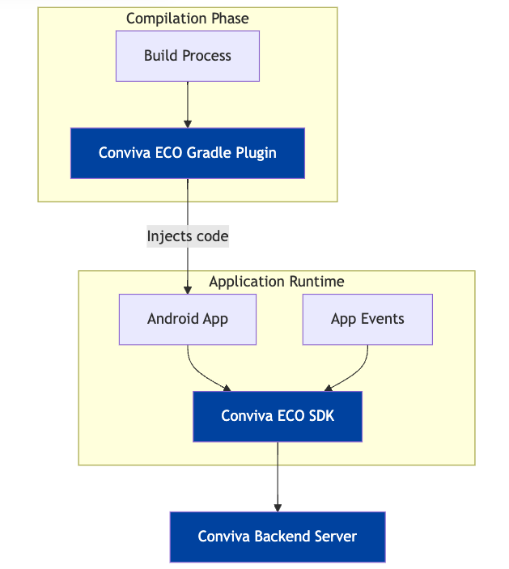

# Conviva Android ECO SDK

Use Conviva Android ECO SDK to auto-collect events and track application-specific events and state changes.

**Table of Contents**
- [Quick Start](#quick-start)
- [More Features](#more-features)
- [Auto-collected Events](#auto-collected-events)
- [FAQ](#faq)

## Quick Start

<details>
<summary><b>Supported Android Version</b></summary>
Target SDK version: Android 14 (API level 34)

Minimum SDK version: Android 5.0 (API level 21)
</details>

### 1. Download

- Add the following line to the app's **build.gradle** file along with the dependencies:

```groovy
// Groovy DSL build.gradle
implementation 'com.conviva.sdk:conviva-android-tracker:<version>'
```
```kotlin
// Kotlin DSL build.gradle.kts
implementation("com.conviva.sdk:conviva-android-tracker:<version>")
```

Replace `<version>` with the latest SDK version available [here](https://github.com/Conviva/conviva-android-appanalytics/releases).

For offline use, download the `.aar` from GitHub's [releases page](https://github.com/Conviva/conviva-android-appanalytics/releases).

- Add the plugin. Replace `<version>` with the latest compatible plugin version from [Conviva Android ECO Plugin](https://github.com/Conviva/conviva-android-plugin).

```groovy
// Groovy DSL
// in the root or project-level build.gradle
buildscript {
    // ...
    dependencies {
        // ...
        classpath 'com.conviva.sdk:android-plugin:<version>'
    }
}

// in the app's build.gradle at the end of plugins add
plugins {
    // ...
    id 'com.conviva.sdk.android-plugin'
}
```
```kotlin
// Kotlin DSL
// in the root or project-level build.gradle.kts
// Conviva Android ECO Plugin is not available in Gradle Plugin Portal yet.
// Please download the plugin from Maven Central.
buildscript {
    // ...
    dependencies {
        // ...
        classpath("com.conviva.sdk:android-plugin:<version>")
    }
}

// in the app's build.gradle.kts at the end of plugins add
plugins {
    // ...
    id("com.conviva.sdk.android-plugin")
}
```

<details>
<summary><b>Diagram</b></summary>



</details>

**Proguard rules / Multidex Config**

Please add the following Proguard rules to keep Conviva SDK classes from obfuscation. If multidex is enabled and a multidex-config.pro is being used by the application, please add the same rule to the multidex-config.pro file.

```plaintext
-keep class com.conviva.** { *; }
```

### 2. Initialization

Use the `ConvivaAppAnalytics.createTracker(context, customerKey, appName)` API to initialize the Conviva Android ECO SDK.

#### Note: It is recommended to initialize the tracker at the start of the application before the first activity class.

```java
import com.conviva.apptracker.ConvivaAppAnalytics;

public class MyApplication extends Application {
    @Override
    public void onCreate() {
        super.onCreate();
        TrackerController tracker = ConvivaAppAnalytics.createTracker(this, customerKey, appName);
        // ...
    }
}
```
**customerKey** - A string to identify a specific customer account. Different keys should be used for development/debug versus production environments. Find your keys on the My Profile page in [Pulse](https://pulse.conviva.com/app/profile/applications).

**appName** - A string value used to distinguish your applications. Simple values that are unique across all of your integrated platforms work best here.

```java
// The tracker object can be retrieved using the following API in other classes after initialization.
TrackerController tracker = ConvivaAppAnalytics.getTracker();
```

### 3. Set the User ID
User ID is a unique identifier used to distinguish individual viewers or devices. For example, an Android UUID. If the [Conviva Video Sensor](https://github.com/Conviva/conviva-android-coresdk) is integrated, set it to the same value as the Viewer ID reported for Video.

```java
tracker.getSubject().setUserId(userId);
```
After completing steps 1, 2, and 3, go to the [validation dashboard](https://pulse.conviva.com/app/appmanager/ecoIntegration/validation) to verify the reporting of the [auto-collected events](#auto-collected-events). (_Conviva login required_)

## More Features
### Track Custom Event

Use the **trackCustomEvent()** API to track all kinds of events. This API provides 2 fields to describe the tracked events:

**eventName** - Name of the custom event

**eventData** - Any type of data in JSONObject format

```java
// Set up the event properties JSONObject
JSONObject eventDataJSON = new JSONObject();
eventDataJSON.put("identifier1", intValue);
eventDataJSON.put("identifier2", boolValue);
eventDataJSON.put("identifier3", "stringValue");

String eventName = "your-event-name";

tracker.trackCustomEvent(eventName, eventDataJSON);
```

### Set Custom Tags
Custom Tags are global tags applied to all events and persist throughout the application lifespan, or until they are cleared.

The following example shows the implementation of the application using these APIs:

Use the **setCustomTags()** API to set custom tags
```java
// Adds the custom tags
HashMap<String, Object> tags = new HashMap<>();
tags.put("key1", intValue);
tags.put("key2", boolValue);
tags.put("key3", "stringValue");
tracker.setCustomTags(tags);
```

Use the **clearCustomTags()** API to clear a few of the previously set custom tags
```java
// Clears custom tags key1 & key2
Set<String> clearTagKeysSet = new HashSet<>();
clearTagKeysSet.add("key1");
clearTagKeysSet.add("key2");
tracker.clearCustomTags(clearTagKeysSet);
```

Use the **clearAllCustomTags()** API to clear all the previously set custom tags

```java
// Clears all the custom tags
tracker.clearAllCustomTags();
```

### Traceparent Header generation and collection

Please contact a Conviva representative to enable this feature.

### Override Activity Name

This feature supports overriding the default Activity Name in the Screen View Event. Add the public variable _convivaScreenName_ in the corresponding activity which you want to set the screen name.

The following example shows how to override the default Activity name:

```java
public class ExampleActivity extends Activity {
    // ...
    public String convivaScreenName = "HomeScreen";
    // ...
}
```

## Auto-collected Events

Conviva provides a rich set of application performance metrics with the help of automatically collected app events. Below are the events that are automatically collected once the [Quick Start](#quick-start) is complete.

<details>

<summary><b>Auto-collected events table</b></summary>

| Event | Occurrence |
| --- | --- |
| network\_request | After receiving the network request response. [Refer limitations](#limitations). _Collected by plugin._ |
| screen\_view | When the screen is interacted with on either first launch or relaunch. [Refer limitations](#limitations). _Collected by plugin._ |
| application\_error | When an error occurs in the application |
| button\_click | On the button click callback (works with both Clickable Views and Clickable Modifiers in compose). _Collected by plugin._ |
| application\_background | When the application is taken to the background |
| application\_foreground | When the application is taken to the foreground |
| application\_install | When the application is launched for the first time after it's installed. (It's not the exact installed time.) [Refer limitations](#limitations). |
| deep\_link\_received | On opening an application using the UTM URL. _Collected by plugin._ |
| anr\_start | Timer starts for the response from the main thread. If it takes more than 4 seconds, _anr\_start_ event is triggered. |
| anr\_end | If the SDK gets a response after triggering _anr\_start_, then _anr\_end_ is dispatched. |
| conviva\_fragment\_view | Whenever a fragment transaction commits. _Collected by plugin._ |
| conviva\_compose\_view | Whenever a destination change occurs in the NavController of the ComposeNavigation. _Collected by plugin._ |

To learn about the default metrics for analyzing the native and web applications performance, such as App Crashes, Avg Screen Load Time, and Page Loads, refer to the [App Experience Metrics](https://pulse.conviva.com/learning-center/content/eco/eco_metrics.html) page in the Learning Center.

</details>

### Limitations

<details>
  <summary><b>screen_view, application_install</b></summary>

  Auto-collection of **screen_view** and **application_install** events is temporarily affected due to controlled ingestion by Conviva.
  This impact occurs only during the first fresh launch after an app install or clear-data. It is valid only until the Conviva Remote Config becomes available and will no longer persist in subsequent launches.

</details>

<details>
  <summary><b>network_request</b></summary>
  This feature supports OkHttp, Retrofit, HTTPSUrlConnection, HTTPUrlConnection (tracking URL.getContent() and URL.getStream() are not supported).

  **Request and Response Body Collection:**

  Collected only when:
  - Size is < 10KB and content-length is available.
  - Content-type is `"json"` or `"text/plain"`.
  - Data is a `JSONObject`, nested `JSONObject`, or `JSONArray`.

 **Request and Response Header Collection:**

 Collected only when:
 - Data is a `JSONObject` (nested `JSONObject` and `JSONArray` are not yet supported).
 - The server is provisioned with `"Access-Control-Expose-Headers:"`.

</details>

## FAQ

[ECO Integration FAQ](https://pulse.conviva.com/learning-center/content/sensor_developer_center/tools/eco_integration/eco_integration_faq.htm)
